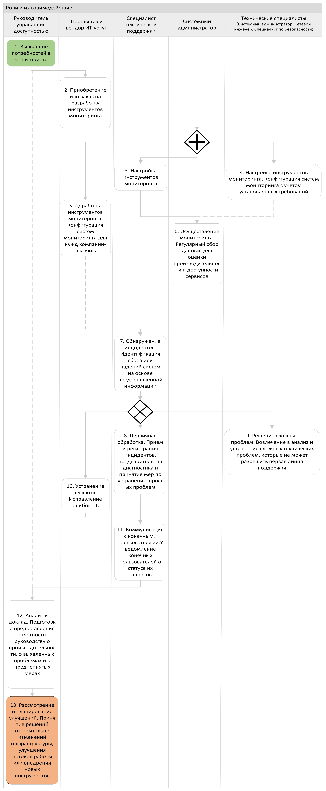

   # 1. Термины, определения и сокращения
**Доступность** - способность конфигурационной единицы или услуги выполнять согласованную функцию, когда это требуется. Доступность определяется через надежность, сопровождаемость, обслуживаемость, производительность и безопасность.\
**Управление доступностью** - процесс, отвечающий за определение, анализ, планирование, измерение и улучшение всех аспектов доступности услуги. Управление доступностью отвечает за то, чтобы вся инфраструктура, процессы, средства, роли и т.д. соответствовали согласованным Целевым показателям уровня услуги в части Доступности.\
**Уровень Обслуживания (SLA)** - документ, определяющий обязательства между поставщиком услуг и заказчиком, определяющая ожидаемый уровень услуги, включая доступность и производительность.\
**Уровень доступности** - метрика, определяющая процент времени, в течение которого ИТ-система или сервис должны быть доступными для пользователей.\
**Резервное копирование данных** - процесс создания резервных копий данных, чтобы обеспечить возможность восстановления в случае их потери или повреждения.\
**Отказоустойчивость** - возможность ИТ-системы или сервиса продолжать работать в случае отказа одного или нескольких компонентов или системных частей.\
**Мониторинг доступности** - процесс систематического наблюдения и контроля за доступностью ИТ-услуг, включая мониторинг производительности и обнаружение проблем.\
**Мониторинг доступности** - процесс систематического наблюдения и контроля за доступностью ИТ-услуг, включая мониторинг производительности и обнаружение проблем.\
**План восстановления после сбоя (DRP)** - документированный план, содержащий процедуры для восстановления ИТ-системы и сервисов после катастрофических сбоев или аварийных ситуаций.\
**Балансировка нагрузки** - распределение нагрузки между несколькими серверами или ресурсами с целью обеспечения равномерной загрузки и предотвращения перегрузок.\
**Паверлифтинг** - процесс переноса ИТ-инфраструктуры и оборудования в другое место или данные на другие сервера для обеспечения доступности в случае катастрофических ситуаций.\
**Изоляция** - технические или архитектурные меры, направленные на минимизацию влияния отказов или проблем в одной части системы на другие компоненты или ИТ-услуги.\
**Восстановление после чрезвычайных ситуаций** - процесс восстановления ИТ-системы и сервисов после чрезвычайных ситуаций, таких как пожары, наводнения, террористические акты и другие.\
**Тестирование восстановления** - процесс проверки эффективности планов восстановления после сбоя путем имитации сбоев или аварийных ситуаций и проверки работоспособности процедур восстановления.\
**Регулярное обслуживание и обновления** - процесс проведения регулярных профилактических работ, включая обновление программного обеспечения, замену устаревшего оборудования и прочие мероприятия для поддержания доступности ИТ-услуг.\
**План Обеспечения Непрерывности Бизнеса (BCP)** - план, обеспечивающий непрерывность операций и минимизацию потерь в случае непредвиденных событий.\
**Service Desk** - это информационная система, предназначенная для организации и автоматизации процесса обслуживания клиентов или пользователей компании. Она позволяет эффективно отслеживать запросы и проблемы пользователей, регистрировать их, отслеживать их статусы и решать их в соответствии с установленными процедурами.

# 2. Общие положения
**Целью процесса Управления доступностью** является обеспечение рентабельного и согласованного Уровня Доступности ИТ-сервиса, который эффективен по затратам и соответствует текущим или будущим потребностям бизнеса.\
В ходе достижения поставленной цели Регламент решает следующие **задачи**:
* Формирование Плана управления доступностью - план, обеспечивающий эффективное по затратам выполнение текущих и будущих требований доступности к услуге.
* Предоставление рекомендации и руководства пользования для других областей бизнеса и IT по всем вопросам, связанным с доступностью.
* Обеспечение того, чтобы услуги достигали установленных целевых показателей в контексте доступности, путем управления услугами и ресурсами.
* Содействие в диагностировании и разрешении проблем, связанных с доступностью.
* Оценка влияния изменений на План управления доступностью.
* Обеспечение того, чтобы проактивные средства для улучшения доступности были внедрены там, где это экономически оправдано.

Для решения задач Регламент включает **ключевые операционные этапы**:
1. **Мониторинг и оценка доступности** - непрерывный контроль состояния IT-систем и их способности функционировать согласно SLA.
2. **Анализ причин недоступности** - расследование инцидентов с целью установления источников проблемы и определения факторов, способствующих сбоям.
3. **Определение корректирующих действий** - меры для решения выявленных проблем, восстановление функциональности и предотвращение повторения подобных инцидентов.
4. **Составление плана действий для аналогичных ситуаций** - создание документированых процедур для разрешения аналогичных ситуаций или прогнозирования возможных угроз и разработки соответствующих планов реагирования.

# 3. Участники процесса
**Заказчик**\
*Ответственность*: владелец бюджета проекта, поставщик предъявляемых требований, высокоуровневый контроль хода работ, приемка готового программного продукта и документации, финансирование проектов по созданию и поддержке IT-инфраструктуры, поддержание коммуникации с руководителем процесса управления доступностью.\
*Деятельность*: формирование требований к продукту, согласование и утверждение бюджета проекта, участие в ПСИ и опытной эксплуатации, проверка документации, подписание контрактов и соглашений с поставщиками IT-услуг.\
**Руководитель процесса управления доступностью**\
*Ответственность*: определение процесса и его разработка в организации, обеспечение разработки ИТ-сервисов, при которой достигнутые Уровни Сервиса (в плане доступности, надежности, обслуживания и способности к восстановлению) будут соответсвовать согласованным уровням
оптимизация доступности ИТ-инфраструктуры с целью обеспечения рентабельного улучшения сервиса, предоставляемого бизнесу.\
*Деятельность*: составление графиков технического обслуживания и ремонта, разработка планов восстановления после сбоев, обеспечение непрерывной работы и доступности всех ключевых IT-систем.\
**Поставщик ИТ-услуг**\
*Ответственность*: обеспечение надежной и эффективной работы всех внешних IT-услуг, соблюдение условий контрактов и уровней обслуживания,(SLAs), консультации по вопросам улучшения IT-инфраструктуры.\
*Деятельность:* техническая поддержка и обслуживание IT-систем, периодическое обновление и модернизация оборудования и программного обеспечения, предоставление отчетов о работе и использовании ресурсов заказчику.\
**Специалист по безопасности**\
*Ответственность*: внедрение и поддержка политик безопасности, защита информации, контроль доступа к системам и данным, анализ угроз и уязвимостей, разработка и реализация мер по предотвращению инцидентов.\
*Деятельность*: мониторинг событий безопасности и реагирование на инциденты, планирование и проведение аудита систем безопасности, внедрение систем обнаружения и предотвращения вторжений.\
**Сетевой инженер**\
*Ответственность*: обеспечение штатной работы и информационной безопасности оборудования и сети, конфигурирование (внесение изменений в режимы работы) оборудование, установка и демонтах оборудования.\
*Деятельность*: работа над архитектурой сети, её настройкой, оптимизацией и мониторингом, обеспечени надёжного доступа к сетевым ресурсам и приложениям, развертывание - установка и пуско-наладочные работы нового вычислительного или сетевого оборудования, обеспечение ремонта оборудования, изменение его конфигураций по запросу, выполнение регулярных работ по обслуживанию, обеспечению резервирования, непрерывности и доступности, восстановление после сбоев, диагностика, обновление и модернизация.\
**Системный администратор**\
*Ответственность*: обеспечение штатной работы и информационной безопасности систем, сервисов и программного обеспечения, конфигурирование (внесение изменений в режимы работы).\
*Деятельность*: развертывание новых систем (или оборудования/сети/программного обеспечения), изменение их конфигураций по запросу, выполнение регулярных работ по обслуживанию, обеспечению резервирования, непрерывности и доступности, восстановление после сбоев, диагностика, предоставление и удаление доступа пользователей, обновление и модернизация.\
**Администратор баз данных**\
*Ответственность:* гарантирование целостности, доступности и безопасности баз данных, проведение резервного копирования и восстановления данных, мониторинг производительности и оптимизация работы баз данных.\
*Деятельность:* обновление схем баз данных и настройка хранилищ данных, обеспечение синхронизации данных между производственными и бизнес-приложениями, разработка запросов и отчетов для аналитических потребностей бизнеса.\
**Специалист технической поддержки**\
*Ответственность:* общение с потребителями ИТ-услуги по их обращениям, уточнение сути обращения, решение инцидентов и проблем, эскалация на более высокий уровень.\
*Деятельность:* выступает связующим звеном между пользователем, системным администратором и разработчиком. Уточняет суть обращения, пытается решить инцидент или проблему самостоятельно, проводит диагностику, ищет способы решения по базе знаний, в случае невозможности самостоятельного решения, эскалирует задачу на системного администратора или разработчика.\
**Пользователи**\
Рабочие и операторы, использующие системы для выполнения своих повседневных операций на производстве. Их обратная связь важна для обеспечения оперативности работы IT систем.

# 4. Общая схема процесса

Процесс Управления доступностью начинает действовать после определения бизнесом требований к доступности сервиса. Это непрерывный процесс, который заканчивается только тогда, когда прекращается представление сервиса.

### Поставщики
- **Технический персонал**: предоставляет информацию о состоянии производственных систем и потребностях в IT-поддержке.
- **Поставщики технологий и оборудования**: поставляют специализированное оборудование и программное обеспечение для управления производственными процессами.
- **Поставщики услуг связи**: обеспечивают необходимую инфраструктуру для передачи данных по сети.
- **IT-подразделение**: предлагают экспертизу в области IT инфраструктуры, поддержки, безопасности и разработки ПО.
- **Отдел качества и безопасности**: обеспечивает стандарты качества на основе требований промышленной безопасности и нормативных актов.

### Входы
- Требования бизнеса к к доступности.
- Оценка влияния на все бизнес-процессы, поддерживаемые ИТ.
- Требования к доступности, надежности и обслуживанию ИТ-компонентов инфраструктуры.
- Данные о неисправностях, затрагивающих услуги или их компоненты, обычно в форме записей и отчетов об инцидентах и проблемах.
- Данные о конфигурациях услуг и их компонентах и данные мониторинга.
- Достигнутые Уровни Сервиса в сравнении с согласованными уровнями для всех услуг, оговоренных в соглашении о предоставлении сервиса.

### Процессы
- Мониторинг всех аспектов доступности, надежности и обслуживаемости ИТ сервисов и поддерживающих их компонентов.
- Поддержание комплекса методов, приемов и расчетов для всех измерений и метрик по доступности и отчетности.
- Оценка и управление рисками.
- Сбор метрик, анализ и производство регулярных и специальных отчетов по доступности ИТ сервиса и компонентов.
- Понимание текущего и будущего спроса на ИТ сервисы и их доступность.
- Производство плана по доступности, который дает возможность Компании предоставлять сервисы в соответствии с целями по доступности, определенными в соглашениях об уровне сервиса, и планировать и прогнозировать требуемые уровни доступности в будущем.
- Содействие в идентификации и разрешении всех инцидентов и проблем, связанных с недоступностью сервиса или компонентов.
- Активное улучшение доступности сервиса или компонентов, если это экономически оправдано.

### Выходы
- Критерии разработки архитектуры для обеспечения доступности и восстановления новых и улучшаемых ИТ-услуг.
- Технология, обеспечивающая устойчивость инфраструктуры и позволяющая уменьшить или устранить воздействие дефектных компонентов.
- Гарантии доступности, надежности и обслуживания компонентов инфраструктуры, необходимые для предоставления ИТ-сервиса.
- Отчеты о достигнутых Уровнях Доступности, надежности и обслуживания.
- Требования к мониторингу доступности, надежности и обслуживания.
- План обеспечения доступности для проведения проактивного улучшения ИТ-инфраструктуры.

### Получатели
- **Производственный персонал**: зависит от доступности систем управления процессом производства.
- **Руководство**: полагается на доступность информационных систем для принятия управленческих решений.
- **Отдел продаж и маркетинга**: нуждаются в доступе к информационным системам для управления заказами, инвентаризации и взаимодействия с клиентами.
- **Отдел контроля качества**: их работа во многом зависит от доступности систем, которые отслеживают и документируют качество продукции.
- **Служба ИТ-поддержки**: работает с информационными системами и управляет инцидентами, относящимися к доступности.
- **Эксплуатационный отдел**: отвечает за надежность оборудования и систем, включая наладку и обслуживание IT-компонентов, используемых в производственных процессах.
- **Конечные пользователи**: персонал, который в своей работе зависит от доступности IT-ресурсов.

### Описание шагов общей схемы
1. **Фиксация жалобы на недоступность сервиса или системы** – пользователь сообщает о проблеме.
2. **Первичный приём и регистрация жалобы** – техподдержка регистрирует обращение пользователя.
3. **Первичный анализ и решение уровня поддержки** – техподдержка проводит первичный анализ и пытается устранить простые проблемы.
4. **Мониторинг состояния оборудования и программного обеспечения** – тистемный администратор контролирует работу серверов и сервисов.
5. **Диагностика проблем баз данных** – админ БД обеспечивает стабильность и производительность баз данных.
6. **Управление и координация внутренних ресурсов** – организация решения проблемы с помощью внутренних ИТ-ресурсов.
7. **Координация действий с внешними поставщиками** – обеспечение взаимодействия с внешними поставщиками для разрешения проблем.
8. **Анализ и решение проблем сети** – определение и устранение проблем в сетевой инфраструктуре.
9. **Оценка проблемы с точки зрения безопасности** – анализ инцидентов на предмет угроз безопасности данных.
10. **Анализ причин недоступности и выработка стратегии** – глубокий анализ случившегося и формирование стратегического плана по предотвращению подобных проблем в будущем.
11. **Составление и утверждение плана действий** – разработка и утверждение плана действий, а также обеспечение его выполнения.
12. **Оценка эффективности принятых мер** – последующая оценка результативности предпринятых мер с целью продолжительного улучшения процессов.

# 5. Описание этапов процесса
## 5.1 Мониторинг и оценка доступности
Процессы
- Мониторинг всех аспектов доступности, надежности и обслуживаемости ИТ сервисов и поддерживающих их компонентов.
Этот процесс включает в себя динамичное отслеживание за состоянием ИТ-инфраструктуры, в том числе за сервисами и компонентами, которые обеспечивают их бесперебойную работу. Задача мониторинга - гарантировать, что все ИТ-системы функционируют надежно и доступны пользователю, а также обеспечить эффективное управление изменениями и инцидентами. Мониторинг помогает оперативно идентифицировать возможные уязвимости и проблемы, влияющие на качество и доступность сервисов, что позволяет своевременно реагировать и минимизировать их отрицательное влияние на бизнес.
- Поддержание комплекса методов, приемов и расчетов для всех измерений и метрик по доступности и отчетности.
Этот процесс задействует разработку и использование стандартизированных протоколов и алгоритмов для измерения и отслеживания метрик доступности и производительности ИТ-сервисов. Целью является обеспечение наличия точных и последовательных данных, которые можно использовать для формирования аналитических отчетов и целенаправленного улучшения ИТ-услуг. Процесс предполагает постоянную оценку и улучшение инструментов измерения для того, чтобы обеспечить релевантность собираемой информации и помочь руководству в принятии обоснованных управленческих решений.

| № | Шаг                        | Описание                                                                                       | Результат                                           | Действия в Service Desk                 |
|---|----------------------------|------------------------------------------------------------------------------------------------|-----------------------------------------------------|------------------------------------------|
| 1 | Выявление потребностей в мониторинге | Определение требований к мониторингу и уровням служб (SLA), утверждение стратегии мониторинга. | Определены требования к мониторингу и SLA.         | Получение запросов от пользователей и уточнение требований к мониторингу. |
| 2 | Настройка инструментов мониторинга      | Конфигурация систем мониторинга с учетом установленных ранее требований.                    | Настроенные инструменты мониторинга.                | Установка и настройка инструментов мониторинга на сервере. |
| 3 | Осуществление мониторинга              | Регулярный сбор данных от систем мониторинга для оценки производительности и доступности сервисов. | Собранные данные от систем мониторинга.           | Мониторинг работы систем и сервисов. |
| 4 | Обнаружение инцидентов                 | Идентификация сбоев или падений систем на основе предоставленной информации по мониторингу. | Обнаруженные инциденты.                             | Обработка и регистрация обнаруженных инцидентов. |
| 5 | Первичная обработка инцидентов         | Прием и регистрация инцидентов, предварительная диагностика и принятие мер по устранению простых проблем. | Зарегистрированные и обработанные инциденты.       | Предварительная диагностика и решение простых проблем. |
| 6 | Решение сложных проблем                 | Вовлечение в анализ и устранение сложных технических проблем, которые не могут разрешить первая линия поддержки. | Решенные сложные проблемы.                        | Вовлекается специалист по сложным техническим проблемам. |
| 7 | Коммуникация с конечными пользователями  | Уведомление конечных пользователей о статусе их запросов и инцидентов, включая решенные вопросы. | Уведомленные конечные пользователи.                 | Обратная связь с пользователями о решенных запросах и инцидентах. |
| 8 | Анализ и доклад о мониторинге и инцидентах | Подготовка и предоставление отчетности руководству о производительности, о выявленных проблемах и о предпринятых мерах по улучшению. | Подготовленные отчеты и аналитика.                 | Подготовка отчетности о мониторинге и инцидентах. |
| 9 | Рассмотрение и планирование улучшений    | Принятие решений относительно изменений инфраструктуры, улучшения потоков работы или внедрения новых инструментов мониторинга. | Принятые и запланированные улучшения.            | Принятие управленческих решений по улучшению инфраструктуры. |

// TODO:
## 5.2 Анализ причин недоступности
### 5.2.1 Оценка и управление рисками
### 5.2.2 Сбор метрик, анализ и производство регулярных и специальных отчетов по доступности ИТ сервиса и компонентов.
Определение требований к доступности
Факторы успеха и показатели эффективности
Ключевые вопросы безопасности

## 5.3 Определение корректирующих действий
### 5.3.1 Понимание текущего и будущего спроса на ИТ сервисы и их доступность.
### 5.3.2 Содействие в идентификации и разрешении всех инцидентов и проблем, связанных с недоступностью сервиса или компонентов.
Управление обслуживанием

## 5.4 Составление плана
### 5.4.1 Производство плана доступности
### 5.4.2 Активное улучшение доступности сервиса или компонентов, если это экономически оправдано.
Инструментальные средства
Методики
Проблемы и затраты

# Приложения
