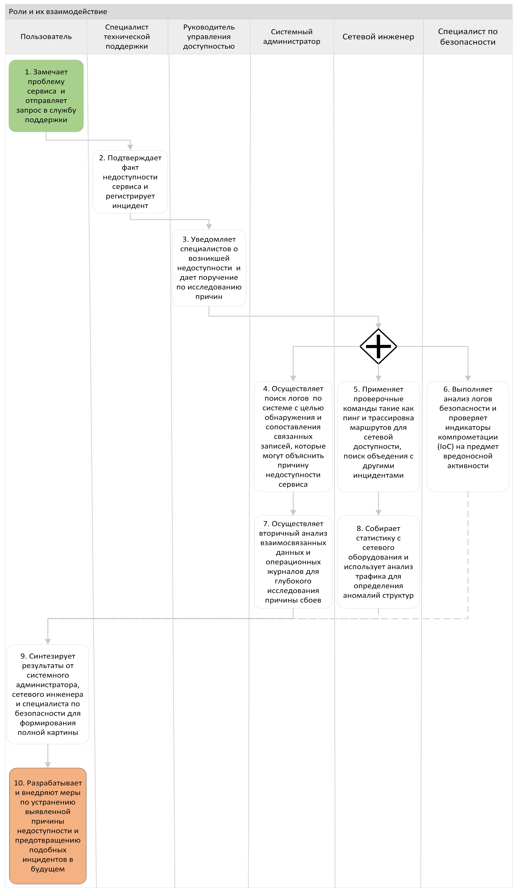
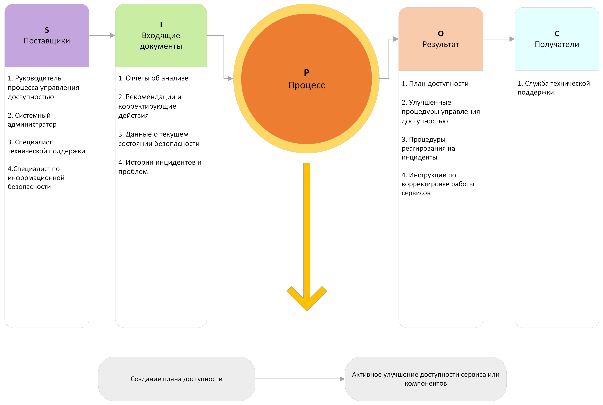
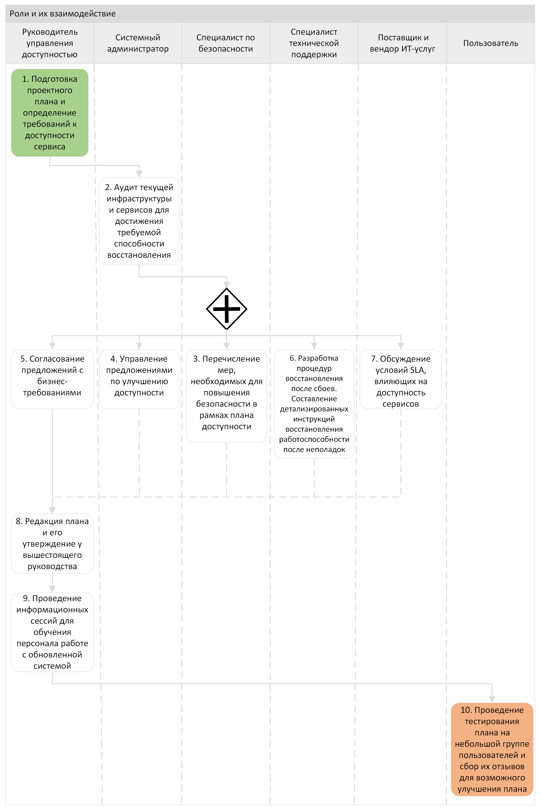

# Регламент управление доступностью
# 1. Термины, определения и сокращения
**Доступность** - способность конфигурационной единицы или услуги выполнять согласованную функцию, когда это требуется. Доступность определяется через надежность, сопровождаемость, обслуживаемость, производительность и безопасность.\
**Управление доступностью** - процесс, отвечающий за определение, анализ, планирование, измерение и улучшение всех аспектов доступности услуги. Управление доступностью отвечает за то, чтобы вся инфраструктура, процессы, средства, роли и т.д. соответствовали согласованным целевым показателям уровня услуги в части доступности.\
**Уровень обслуживания (SLA)** - документ, определяющий обязательства между поставщиком услуг и заказчиком, определяющая ожидаемый уровень услуги, включая доступность и производительность.\
**Уровень доступности** - метрика, определяющая процент времени, в течение которого ИТ-система или сервис должны быть доступными для пользователей.\
**Резервное копирование данных** (Backup copy)  - процесс создания резервных копий данных, чтобы обеспечить возможность восстановления в случае их потери или повреждения.\
**Отказоустойчивость** - возможность ИТ-системы или сервиса продолжать работать в случае отказа одного или нескольких компонентов или системных частей.\
**Мониторинг доступности** - процесс систематического наблюдения и контроля за доступностью ИТ-услуг, включая мониторинг производительности и обнаружение проблем.\
**План восстановления после сбоя (DRP)** - документированный план, содержащий процедуры для восстановления ИТ-системы и сервисов после катастрофических сбоев или аварийных ситуаций.\
**Балансировка нагрузки** (Load Balancing) - распределение нагрузки между несколькими серверами или ресурсами с целью обеспечения равномерной загрузки и предотвращения перегрузок.\
**Паверлифтинг** - процесс переноса ИТ-инфраструктуры и оборудования в другое место или данные на другие сервера для обеспечения доступности в случае катастрофических ситуаций.\
**Изоляция** - технические или архитектурные меры, направленные на минимизацию влияния отказов или проблем в одной части системы на другие компоненты или ИТ-услуги.\
**Восстановление после чрезвычайных ситуаций** - процесс восстановления ИТ-системы и сервисов после чрезвычайных ситуаций, таких как пожары, наводнения, террористические акты и другие.\
**Тестирование восстановления** (Failover and Recovery Testing) - процесс проверки эффективности планов восстановления после сбоя путем имитации сбоев или аварийных ситуаций и проверки работоспособности процедур восстановления.\
**Регулярное обслуживание и обновления** - процесс проведения регулярных профилактических работ, включая обновление программного обеспечения, замену устаревшего оборудования и прочие мероприятия для поддержания доступности ИТ-услуг.\
**План обеспечения непрерывности бизнеса (BCP)** - план, обеспечивающий непрерывность операций и минимизацию потерь в случае непредвиденных событий.\
**Service Desk** - это информационная система, предназначенная для организации и автоматизации процесса обслуживания клиентов или пользователей компании. Она позволяет эффективно отслеживать запросы и проблемы пользователей, регистрировать их, отслеживать их статусы и решать их в соответствии с установленными процедурами.

# 2. Общие положения
**Целью** Регламента управления доступностью является обеспечение рентабельного и согласованного уровня доступности ИТ-сервиса, который эффективен по затратам и соответствует текущим или будущим потребностям бизнеса.\
Для достижения поставленной цели определены следующие **задачи**:
* Формирование плана управления доступностью, обеспечивающего эффективное по затратам выполнение текущих и будущих требований доступности к сервисам.
* Предоставление рекомендации и руководства пользования по всем вопросам, связанным с доступностью IT услуг.
* Обеспечение того, чтобы услуги достигали установленных целевых показателей в контексте доступности, путем управления услугами и ресурсами.
* Содействие в диагностировании и разрешении проблем, связанных с доступностью.
* Оценка воздействия всех принятых изменений на план доступности ИТ-сервиса, на функционирование и производительность ИТ-сервисов и ресурсов.
* Обеспечение того, чтобы проактивные средства для улучшения доступности были внедрены там, где это экономически оправдано.
К основным преимуществам, помимо критериев использования сервисов, отвечающих требованиям доступности, относятся:
* Создание единой точки контактов по вопросам доступности продуктов и услуг и наличие роли, отвечающей за эти вопросы.
* Гарантия соответствия новых продуктов и услуг предъвляемым к ним требованиям и согласованному с заказчиком стандарту доступности.
* Поддержание приемлемого уровня затрат.
* Уменьшение количества отказов в доступе к системам и сокращение периода недоступности сервиса.
* Простота обоснования добавочной стоимости при реорганизации сервисов.

Решение задач обеспечивается в ходе выделенных **ключевых операционных этапов**:
1. **Мониторинг и оценка доступности** - непрерывный контроль состояния IT-систем и их способности функционировать согласно SLA.
2. **Анализ причин недоступности** - расследование инцидентов с целью установления источников проблемы и определения факторов, способствующих сбоям.
3. **Определение корректирующих действий** - меры для решения выявленных проблем, восстановление функциональности и предотвращение повторения подобных инцидентов.
4. **Составление плана действий для аналогичных ситуаций** - создание документированых процедур для разрешения аналогичных ситуаций или прогнозирования возможных угроз и разработки соответствующих планов реагирования.

# 3. Участники процесса
**Руководитель процесса управления доступностью**\
*Ответственность*: определение процесса и его разработка в организации, обеспечение поддержки ИТ-сервисов по согласованным уровням, в плане доступности, надежности, обслуживания и способности к восстановлению, оптимизация доступности ИТ-инфраструктуры с целью обеспечения рентабельного улучшения сервиса, предоставляемого бизнесу.\
*Деятельность*: составление графиков технического обслуживания и ремонта, разработка планов восстановления после сбоев, обеспечение непрерывной работы и доступности всех ключевых IT-систем.\
**Системный администратор**\
*Ответственность*: обеспечение штатной работы и информационной безопасности систем, сервисов и программного обеспечения, конфигурирование (внесение изменений в режимы работы), обеспечение целостности, доступности и безопасности баз данных, проведение резервного копирования и восстановления данных, мониторинг производительности и оптимизация работы баз данных.\
*Деятельность*: развертывание новых систем (или оборудования/сети/программного обеспечения), изменение их конфигураций по запросу, выполнение регулярных работ по обслуживанию, обеспечению резервирования, обновление схем баз данных и настройка хранилищ данных, обеспечение синхронизации данных между производственными и бизнес-приложениями, восстановление после сбоев, диагностика, предоставление и удаление доступа пользователей, обновление и модернизация.\
**Специалист по безопасности**\
*Ответственность*: внедрение и поддержка политик безопасности, защита информации, контроль доступа к системам и данным, анализ угроз и уязвимостей, разработка и реализация мер по предотвращению инцидентов.\
*Деятельность*: мониторинг событий безопасности и реагирование на инциденты, планирование и проведение аудита систем безопасности, внедрение систем обнаружения и предотвращения вторжений.\
**Сетевой инженер**\
*Ответственность*: обеспечение штатной работы и информационной безопасности оборудования и сети, конфигурирование (внесение изменений в режимы работы) оборудование, установка и демонтаж оборудования.\
*Деятельность*: работа над архитектурой сети, её настройкой, оптимизацией и мониторингом, обеспечени надёжного доступа к сетевым ресурсам и приложениям, развертывание - установка и пуско-наладочные работы нового вычислительного или сетевого оборудования, обеспечение ремонта оборудования, изменение его конфигураций по запросу, выполнение регулярных работ по обслуживанию, обеспечению резервирования, непрерывности и доступности, восстановление после сбоев, диагностика, обновление и модернизация.\
**Специалист технической поддержки**\
*Ответственность:* общение с потребителями ИТ-услуги по их обращениям, уточнение сути обращения, решение инцидентов и проблем, эскалация на более высокий уровень.\
*Деятельность:* выступает связующим звеном между пользователем, системным администратором и разработчиком. Уточняет суть обращения, пытается решить инцидент или проблему самостоятельно, проводит диагностику, ищет способы решения по базе знаний, в случае невозможности самостоятельного решения, эскалирует задачу на системного администратора или разработчика.\
**Поставщик и вендор ИТ-услуг**\
*Ответственность*: обеспечение надежной и эффективной работы всех внешних IT-услуг, соблюдение условий контрактов и уровней обслуживания,(SLAs), консультации по вопросам улучшения IT-инфраструктуры.\
*Деятельность:* техническая поддержка и обслуживание IT-систем, периодическое обновление и модернизация оборудования и программного обеспечения, предоставление отчетов о работе и использовании ресурсов заказчику.\
**Пользователь**\
Рабочие и операторы, использующие системы для выполнения своих повседневных операций на производстве. Их обратная связь важна для обеспечения оперативности работы IT систем.

# 4. Общая схема процесса

Процесс управления доступностью начинает действовать после определения бизнесом требований к доступности сервиса. Это непрерывный процесс, который заканчивается только тогда, когда прекращается предоставление сервиса.

### Описание шагов общей схемы
1. и 2. **Фиксация жалобы на недоступность сервиса или системы** – пользователь сообщает о проблеме.
3. **Первичный приём и регистрация жалобы** – техподдержка регистрирует обращение пользователя.
4. **Анализ причин недоступности и выработка стратегии** – глубокий анализ случившегося и формирование стратегического плана по предотвращению подобных проблем в будущем.
5. **Первичный анализ и решение уровня поддержки** – техподдержка проводит первичный анализ и пытается устранить простые проблемы.
6. **Мониторинг состояния оборудования и программного обеспечения** – cистемный администратор контролирует работу серверов и сервисов, обеспечивает стабильность и производительность баз данных.
7. **Управление и координация внутренних ресурсов** – организация решения проблемы с помощью внутренних ИТ-ресурсов.
8. **Обеспечение взаимодействия с внешними поставщиками** – обеспечение взаимодействия с внешними поставщиками для разрешения проблем.
9. **Анализ и решение проблем сети** – определение и устранение проблем в сетевой инфраструктуре.
10. **Оценка проблемы с точки зрения безопасности** – анализ инцидентов на предмет угроз безопасности данных.
11. **Закрытие обращения** - изменение статуса обращения в Service Desk и возврат пользователю. 
12. **Составление и утверждение плана действий** – разработка и утверждение плана действий, а также обеспечение его выполнения.
13. **Оценка эффективности принятых мер** – последующая оценка результативности предпринятых мер с целью продолжительного улучшения процессов.

# 5. Описание этапов процесса
## 5.1 Мониторинг и оценка доступности

1. Мониторинг факторов доступности, надежности и обслуживаемости ИТ сервисов и поддерживающих их компонентов - процесс, который включает в себя динамическое отслеживание состояния ИТ-инфраструктуры, в том числе сервисов и служб, которые обеспечивают ее бесперебойную работу. Задача мониторинга - гарантировать, что все ИТ-системы функционируют надежно и доступны пользователю, а также обеспечить эффективное управление изменениями и инцидентами. Мониторинг помогает оперативно выявить возможные уязвимости и проблемы, влияющие на качество и доступность сервисов, что позволяет своевременно реагировать и минимизировать их отрицательное влияние на бизнес.

Осуществляется с помощью инструментов, таких как визуальные дашборды и рассылка почтовых сообщений, особое внимание следует уделить факторам:
   * Состояние каждого сервера, на котором стоит мониторинг: скорость и нагрузку на процессоре, емкость дисков, свободное место в оперативной и постоянной памяти
   * Следом идет состояние сети — доступность узлов с сервера, скорость соединений, время пингов
   * Состояние операционной системы — количество и состояние процессов, наличие определенных программ в памяти
   * Метрики и состояния прикладных программ — количество активных пользователей, запросы в СУБД, средняя скорость ответа приложения.

2. Поддержание комплекса методов и расчетов для всех измерений и метрик по доступности и отчетности - процесс, который задействует разработку и использование стандартизированных методов измерения метрик доступности и производительности ИТ-сервисов. Целью является обеспечение наличия точных и последовательных данных, которые можно использовать для формирования аналитических отчетов и целенаправленного улучшения ИТ-услуг. Процесс предполагает постоянную оценку и улучшение инструментов измерения для того, чтобы обеспечить релевантность собираемой информации и помочь руководству в принятии обоснованных управленческих решений.

Приведенная ниже формула помогает определить, отвечает ли достигнутый Уровень доступности согласованным требованиям:\
% доступности = Достигнутое время работоспособности / Согласованное время работоспособности * 100%

Достигнутое время работоспособности системы равно разнице между согласованным временем работоспособности и случившемся временем простоя. Например, если была достигнута договоренность о 98% доступности сервиса в рабочие дни с 7.00 до 19.00 и в течение этого периода был двухчасовой отказ сервиса, то процент доступности будет равен: 100% * (5 * 12 - 2) /5 * 12 = 96.7% .

| № | Шаг                        | Описание                                                                                       | Результат                                           | Действия в Service Desk                 |
|---|----------------------------|------------------------------------------------------------------------------------------------|-----------------------------------------------------|------------------------------------------|
| 1  | Выявление потребностей в мониторинге       | Анализ требований к мониторингу в соответствии с бизнес-процессами                             | Список необходимых параметров для мониторинга | Предоставление исторических данных о проблемах для выявления требований       |
| 2  | Приобретение или разработка инструментов   | Выбор подходящих инструментов или заказ на разработку собственных решений                       | Инструменты или ПО для мониторинга            | Подбор инструментов в соответствии с выявленными потребностями                |
| 3  | Настройка инструментов мониторинга         | Конфигурация приобретенных или разработанных инструментов                                      | Готовые к работе инструменты мониторинга       | Настройка и тестирование инструментов мониторинга                             |
| 4  | Конфигурация систем мониторинга            | Настройка систем под специфические задачи и требования мониторинга                             | Оптимизированная система мониторинга           | Внедрение проверенных конфигураций в рабочую среду                             |
| 5  | Доработка инструментов мониторинга         | Тонкая настройка параметров мониторинга и интеграция с другими системами компании              | Полностью интегрированная система мониторинга  | Оперативное обновление настроек и корректировка инструментов                   |
| 6  | Осуществление мониторинга                  | Регулярный сбор, анализ данных о производительности и доступности сервисов                     | Текущее состояние сервисов и предупреждения    | Регистрация и мониторинг событий, настройка порогов для оповещений             |
| 7  | Обнаружение инцидентов                     | Идентификация и категоризация аномалий и сбоев как инцидентов                                  | Список обнаруженных инцидентов                 | Создание, категоризация и управление инцидентами в системе                     |
| 8  | Первичная обработка                        | Предварительная диагностика проблем и попытки их устранения                                    | Предварительно устраненные инциденты           | Регистрация инцидентов и реализация первичных мер                              |
| 9  | Решение сложных проблем                    | Анализ и устранение сложных технических проблем, недоступных для первой линии поддержки        | Устраненные сложные инциденты                  | Эскалация и сотрудничество со специалистами высшего уровня                     |
| 10 | Устранение дефектов                        | Исправление ошибок ПО, обновление систем                                                      | Повышение качества ПО и стабильности систем    | Документирование решения проблем и обратная связь с разработчиками ПО          |
| 11 | Коммуникация с конечными пользователями   | Уведомление пользователей о статусе их запросов                                               | Информированность пользователей                | Уведомление пользователей о статусе обработки их запросов и инцидентов         |
| 12 | Анализ и доклад                            | Анализ данных, собранных в процессе мониторинга, для выявления трендов, выполнения отчетности и рекомендаций по улучшению | Отчеты с анализом текущего состояния и рекомендациями                    | Составление отчетности; предложения по улучшениям на основе анализа данных; документирование проблем |
| 13 | Рассмотрение и планирование улучшений      | Реализация плана улучшений на основе анализа, нацеленная на оптимизацию процессов и технологий                    | План улучшений, направленный на повышение эффективности и надежности систем | Обсуждение улучшений с руководством и планирование мер по внедрению изменений                     |

## 5.2 Анализ причин недоступности

1. Оценка и управление рисками - процесс, который включает в себя идентификацию потенциальных угроз для ИТ-систем и данных, анализ этих угроз по степени вероятности их возникновения и возможного ущерба, разработку стратегий для их предотвращения или минимизации воздействия, а также непрерывный мониторинг и пересмотр оценок рисков на основе изменяющихся условий или новой информации.

2. Сбор метрик, анализ и производство отчетов по доступности ИТ-сервиса и компонентов – это непрерывный процесс измерения ключевых показателей эффективности ИТ-системы (например, время отклика, время работы без сбоев и т.д.), анализа этих данных для определения тенденций и выявления потенциальных проблем, а также создания и предоставления отчетов, которые объективно отражают текущее состояние и полезность ИТ-сервисов для заинтересованных сторон.

Критическими факторами успеха Процесса Управления Доступностью сервиса являются:
* наличие у бизнеса четко определенных целей и пожеланий в отношении доступности сервиса
* налаженный Процесс Управления Уровнем Сервиса для обеспечения формализации соглашений
* одинаковое понимание сторонами понятий доступности и простоя
* понимание как бизнесом, так и ИТ-организацией преимуществ Управления Доступностью.\
Об эффективности и рациональности Процесса Управления Доступностью свидетельствуют такие показатели эффективности, как:
* доступность сервиса в процентном выражении (время работоспособности) в проекции услуг или групп пользователей
* продолжительность простоев
* частота возникновения простоев

| №  | Шаг                                  | Описание                                                                                           | Результат                                                     | Действия в Service Desk                            |
|----|--------------------------------------|----------------------------------------------------------------------------------------------------|---------------------------------------------------------------|----------------------------------------------------|
| 1  | Запуск Процесса Анализа              | Инициация этапа анализа после обнаружения недоступности.                                           | Решение о начале анализа причин.                               | Ожидание результатов анализа.                       |
| 2  | Сбор Данных                          | Автоматизированное или ручное собирание информации, связанной с инцидентом.                       | Собранная информация для анализа.                              | Проверка полноты собранных данных.                  |
| 3  | Оценка Информации                    | Анализ начальной информации для выделения ключевых моментов инцидента.                             | Список потенциальных причин недоступности.                     | Оповещение о необходимости доведения информации.    |
| 4  | Классификация Проблем                | Распределение выявленных вопросов по категориям для удобства анализа.                              | Классифицированные данные по проблемам.                        | Распределение задач среди команд специалистов.      |
| 5  | Выработка гипотезы                      | Формулирование возможных предположений о причинах на основании классифицированной информации.      | Список гипотез для проверки.                                   | Трекинг процесса гипотезирования.                   |
| 6  | Проверка Гипотез                     | Проведение отладочных процессов и сценариев, целью которых является подтверждение гипотез.         | Подтвержденные или опровергнутые гипотезы.                     | Фиксация результатов проверки гипотез.              |
| 7  | Анализ Результатов Тестов            | Анализ данных, полученных в результате проверки гипотез.                                           | Окончательный список возможных причин инцидента.               | Обновление статуса инцидента согласно результатам.  |
| 8  | Документирование Промежуточных Итогов| Запись информации о проделанных операциях и достигнутых результатах на промежуточных этапах.       | Документация для отчетности и возможного будущего использования.| Сбор и оформление документации по инциденту.        |
| 9  | Определение Окончательной Причины    | Конкретизация финальной причины недоступности на основе всех собранных данных.                     | Определение окончательной причины инцидента.                    | Принятие мер по информированию заинтересованных сторон.      |
| 10 | Передача Результатов                 | Готовые результаты анализа передаются для последующего определения корректирующих действий.       | Результата анализа переданы для определения корректирующих действий.| Обеспечение передачи информации в соответствующий отдел.    |

## 5.3 Определение корректирующих действий

1. Оценка текущего и будущего спроса используемых  сервисов и их доступность. Это процесс, в котором анализируются тренды использования ИТ-ресурсов и прогнозируется будущий спрос на ИТ-сервисы. Основная цель здесь - предвидеть потребности бизнеса и пользователей, чтобы обеспечить бесперебойное предоставление ИТ-сервисов в соответствии с бизнес-требованиями и ожиданиями. Это включает анализ исторических данных, изучение рыночных тенденций, понимание бизнес-планов организации и соответствующее планирование масштабируемости и ресурсов.

2. Участие в идентификации и разрешении всех инцидентов и проблем, связанных с недоступностью сервиса или компонентов. Этот процесс охватывает деятельность, связанную с обработкой и управлением инцидентами, которая включает быстрое реагирование на инциденты (нежелательные или незапланированные прерывания ИТ-сервиса или снижение его качества) и проблемы (основные причины одного или нескольких инцидентов). Задачи, связанные с этим процессом, включают обеспечение регистрации и классификации инцидентов, их приоритизацию, диагностику, временное и постоянное решение проблемы, а также анализ причин возникновения с целью предотвращения будущих инцидентов. Дополнительно, процесс включает координацию между разными группами в ИТ-службе, а также коммуникацию с пользователями и руководством.

Затраты на процесс состоят из:
* затрат на внедрение процесса
* затрат на персонал
* затрат на устройства
* затрат на инструментальные средства измерения и составления отчетов.\
Для улучшения показателей доступности необходимо уже на ранних этапах определить необходимый уровень инвестиции в этот процесс. Всегда должен выполняться анализ рентабельности, так как обычно улучшение доступности связано с ростом затрат.
При обсуждении стоимости и преимуществ внедрения процесса следует руководствоваться тем, какими могли бы быть затраты, если полностью игнорировать Процесс Управления Доступностью и оказаться в ситуации, когда не будут выполнены согласованные требования по доступности сервиса. Такая ситуация может иметь следующие последствия для заказчика:
* снижение производительности
* уменьшение оборота бизнеса и прибыли
* затраты на восстановление
* возможные претензии третьих сторон и т д.

Перечисленные ниже аспекты трудно представить в количественном выражении, тем не менее они очень важны:
* потеря престижа и заказчиков
* потеря репутации и доверия
* потеря мотивации персонала и удовлетворенности работой.\
Процесс Управления Доступностью может помочь ИТ-организации избежать этих потерь и достичь поставленных целей путем предоставления заказчикам необходимых услуг по приемлемой и обоснованной цене.

| №  | Шаг                                  | Описание                                                                                           | Результат                                                     | Действия в Service Desk                            |
|----|--------------------------------------|----------------------------------------------------------------------------------------------------|---------------------------------------------------------------|----------------------------------------------------|
| 1  | Анализ инцидентов и выявление причин        | Первичный анализ инцидентов, сбор логов и отчетов от пользователей.                                        | Отчет по инциденту с определенными причинами их возникновения.           | Запись всех полученных данных об инциденте, начальная категоризация. |
| 2  | Изоляция проблемы и оценка воздействия      | Оценка затронутых сервисов и систем, определение приоритетов для восстановления работы.                    | Список затронутых сервисов и приоритетов для коррекции.                  | Обновление информации по затронутым сервисам в тикетах.              |
| 3  | Разработка процедур устранения проблемы     | Подготовка методик исправления, планирование изменений в инфраструктуре.                                   | План устранения неполадок с четкими инструкциями.                        | Планирование времени устранения и оперативных действий.               |
| 4  | Проектирование мер по увеличению безопасности | Разработка новых рекомендаций для улучшения безопасности, аудит уязвимостей.                              | Набор мероприятий для усиления безопасности.                             | Документирование новых политик безопасности и их внедрение.           |
| 5  | Разработка процедур корректирующих действий | Формирование общего плана корректирующих действий, включая распределение задач и ресурсов.                | Окончательный план корректирующих действий с оговоренными сроками.       | Координация между командами для утверждения плана и начала работ.     |
| 6  | Коммуникация плана действий                 | Обсуждение плана с вендорами и поставщиками, получение необходимой поддержки и ресурсов.                  | Подтверждение участия и поддержки поставщиков и вендоров.                | Обновление записей в тикете с информацией от вендоров.                |
| 7  | Утверждение плана корректирующих действий   | Окончательное утверждение плана корректирующих действий и начало реализации.                              | Завершенный и утвержденный план, готовый к исполнению.                   | Документирование утверждения плана и начало отслеживания выполнения.  |
| 8  | Мониторинг выполнения и эффективности плана | Отслеживание статуса выполнения плана и оценка его эффективности после внесения коррекций.                | Отчет о результатах и оценка эффективности корректирующих действий.      | Непрерывный мониторинг и обновление статуса корректирующих действий. |

## 5.4 Составление плана

1. Создание плана доступности. В этом процессе осуществляется формирование документа, который детализирует стратегию и конкретные действия по поддержанию и улучшению уровня доступности ИТ-сервисов. План включает в себя процедуры для реагирования на инциденты, подходы к мониторингу и предупреждения сбоев, а также графики регулярных ревизий и технического обслуживания.
2. Активное улучшение доступности сервиса или компонентов, если это экономически оправдано. Этот процесс подразумевает регулярный анализ и внедрение улучшений в ИТ-сервисы и инфраструктуру, которые могут повысить их доступность. Внимание уделяется балансу между стоимостью предлагаемых улучшений и выгодами, которые они принесут в плане повышения надежности и доступности сервиса.

План обслуживания должен обеспечить:
* Превентивное обслуживание для избежания отказов
* Плановые обновления программных и аппаратных средств для обеспечения новой функциональности или дополнительной мощности
* Изменения к бизнес приложениям требуемые клиентом
* Внедрение новой технологии и функциональности для использования клиентом.

Если требуемые сервисные часы меньше, чем 24 часа в сутки и/или семь дней в неделю, Компания старается обеспечить большую часть планового обслуживания без воздействия на доступность ИТ сервиса. Если же клиент требует, чтобы ИТ услуги были доступны 24 часа в сутки и семь дней в неделю, управление доступностью определяет наиболее эффективный подход к балансированию требований к плановому обслуживанию и потери сервиса для клиента. В таких случаях разрабатывается календарный график простоев для планового обслуживания.\
Требования к календарному планированию обслуживания должны быть документированы, как минимум, в следующих документах: соглашениях об уровнях сервиса, календарных графиках изменений и релизов.
Календарное планирование простоя сервиса должно учитывать время, когда его воздействие на бизнес клиентов имеет наименьшую величину. Изначально эту информацию должен предоставить Клиент при определении требований к доступности.\
Балансирование требований к плановому простою индивидуального компонента с требованиями Клиента к доступности ИТ сервиса дает Компании возможность проводить календарное планирование обслуживания многочисленных компонентов одновременно.\
Компания рассматривает эффективное управление планируемым временем простоя как важный вклад в удовлетворение требуемых уровней доступности ИТ сервиса. Все плановое обслуживание производится в соответствии с календарными графиками,  управляется и контролируется. Это дает возможность Компании координировать плановое обслуживание со всеми другими планами-графиками, например, календарные планы изменений и релизов, графики тестирования и тем самым свести к минимуму конфликты. Плановое время простоя каждого компонента и фактические результаты регистрируются и отражаются в сервисной отчетности.

| №  | Шаг                                  | Описание                                                                                           | Результат                                                     | Действия в Service Desk                            |
|----|--------------------------------------|----------------------------------------------------------------------------------------------------|---------------------------------------------------------------|----------------------------------------------------|
| 1  | Инициализация и планирование         | Определение целей и задач процесса управления доступностью; разработка проектного плана.          | Утверждённый план проекта.                                    | Настройка проекта в системе отслеживания задач.    |
| 2  | Аудит текущей инфраструктуры         | Анализ текущего состояния и выявление уязвимостей в инфраструктуре и сервисах.                     | Отчёт об аудите текущего состояния инфраструктуры.            | Регистрация инцидентов, выявленных во время аудита. |
| 3  | Определение требований безопасности  | Анализ требований безопасности и их влияние на доступность систем.                                 | Список мер безопасности для плана доступности.                 | Обновление базы знаний с мерами безопасности.      |
| 4  | Разработка предложений               | Составление плана улучшений инфраструктуры для обеспечения требуемого уровня доступности.          | План действий с предложениями по улучшению доступности.        | Отслеживание реализации улучшений.                 |
| 5  | Согласование с бизнес-требованиями   | Сопоставление предложений с бизнес-требованиями и стратегическими целями компании.                 | Документ с согласованными предложениями.                      | Информирование заинтересованных сторон о плане.    |
| 6  | Разработка процедур восстановления   | Создание инструкций для восстановления работоспособности после возможных сбоев.                    | Процедуры и инструкции восстановления системы.                 | Тренинг персонала по процедурам восстановления.    |
| 7  | Взаимодействие с поставщиками        | Координация SLA и мероприятий по повышению доступности с внешними и внутренними поставщиками.      | Утверждённые SLA и договорённость с поставщиками.              | Отслеживание уровня сервиса поставщиков.           |
| 8  | Утверждение плана доступности        | Оформление, ревью и утверждение итогового плана доступности руководством.                          | Утверждённый план доступности.                                 | Внедрение утверждённого плана в сценарии Service Desk.|
| 9  | Обучение и коммуникация              | Информирование персонала, проведение обучающих сессий и коммуникация с заинтересованными сторонами.| Подготовленный и осведомлённый персонал.                       | Создание инструкций и FAQ для персонала.           |
| 10 | Эксплутационное тестирование и получение обратной связи| Испытание плана и сбор обратной связи от пользователей для дальнейшего улучшения.             | Отчёт о реальном использовании с рекомендациями по улучшению.            | Анализ обратной связи и улучшение процессов.       |

# Список источников
1. **ISO/IEC 27001** - стандарт в области управления информационной безопасностью, который включает аспекты, обеспечивающие конфиденциальность, целостность и доступность информационных активов.

2. **ISO/IEC 20000** - стандарт, определяющий требования к системе управления качеством предоставления услуг информационных технологий (ITSM), что включает их доступность.

3. **ISO 22301** - стандарт, который касается систем управления непрерывностью бизнеса и предназначен для организаций любого типа, размера и природы. Он помогает организациям предотвратить, справиться и быстро восстановиться после возникновения потенциальных прерываний, в том числе и в ИТ-сфере.

4. **ISO/IEC/IEEE 12207:2017** - описывает процессы жизненного цикла программного обеспечения. Этот стандарт определяет процессы, которые необходимы для успешного разработки, эксплуатации и поддержки программного обеспечения. Стандарт охватывает аспекты управления проектами, процессы разработки, эксплуатационные процессы, поддержки, обеспечения качества, тестирования, обслуживания и утилизации программного обеспечения.

# Приложения
