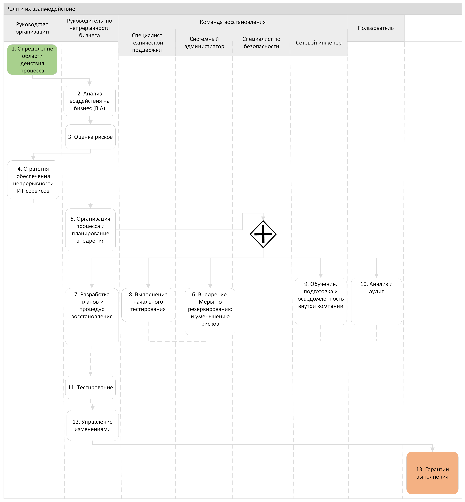

# Регламент управление непрерывностью
# 1. Термины, определения и сокращения
**Бизнес-непрерывность** (Business Continuity): Обеспечение продолжения основной деятельности компании в случае возникновения сбоев, чрезвычайных ситуаций или катастроф.\
**Резервное копирование** (Backup): Процесс создания копий данных и информации, необходимых для восстановления системы при сбое или потере данных.\
**Восстановление после сбоя** (Disaster Recovery): Меры, направленные на восстановление работоспособности системы и данных после сбоя или катастрофы.\
**Риски и уязвимости** (Risks and Vulnerabilities): Потенциальные угрозы, которые могут привести к сбою системы или потере данных.\
**Тестирование восстановления** (Recovery Testing): Процесс проверки эффективности планов восстановления для устранения ошибок или несоответствий.\
**Цель восстановления** (Recovery Objectives): Заданные временные рамки, в которых необходимо восстановить систему после сбоя или катастрофы.\
**Экстренное уведомление** (Emergency Notification): Процесс оповещения сотрудников о возникших сбоях или чрезвычайных ситуациях.\
**Бизнес-процессы** (Business Processes): Серия связанных операций или действий, выполняемых в компании для достижения бизнес-целей.\
**Контингенционное планирование** (Contingency Planning): Разработка стратегий и планов для минимизации воздействия сбоев или катастроф на бизнес-процессы.\
**Резервные центры обработки данных** (Backup Data Centers): Вторичные центры для хранения и обработки данных при сбое основного центра.\
**Мониторинг доступности** (Availability Monitoring): Процесс отслеживания работоспособности и доступности системы или услуг для пользователей.\
**Идентификация уязвимостей** (Vulnerability Identification): Процесс определения слабых мест или уязвимых мест в системе, которые могут быть использованы злоумышленниками.\
**Аварийное отключение** (Emergency Shutdown): Процедура принудительного выключения системы в случае угрозы безопасности или аварии.\
**Автоматизация процессов восстановления** (Recovery Automation): Использование автоматизированных средств и сценариев для восстановления системы после сбоя.\
**Управление рисками** (Risk Management): Процесс и методы оценки, контроля и минимизации рисков, связанных с непрерывностью ИТ-услуг.\
**Постоянное обновление планов** (Plan Maintenance): Регулярное обновление планов и стратегий восстановления на основе изменений в компании и технологических требованиях.\
**Анализ воздействия на бизнес** (Business Impact Analysis): Процесс оценки потенциального влияния сбоев или катастроф на бизнес-процессы и системы компании.

# 2. Общие положения
**Целью** Регламента управления непрерывностью ИТ сервисов является поддержка, при которой необходимая инфраструктура и ИТ-услуги могут быть восстановлены за заданный период времени после возникновения чрезвычайной ситуации, а также обеспечение способности ИТ сервиса предоставлять ценность клиенту даже в условиях, когда решения по нормальной доступности не работают.\
В связи с этим поставлен следующий ряд **задач**:
* Поддержка комплекса планов по непрерывности ИТ сервисов и планов по восстановлению, которые поддерживают общие планы непрерывности бизнеса Компании и Клиентов.
* Проведение регулярного анализа воздействия на бизнес Компании и Клиентов, чтобы все планы по непрерывности ИТ сервиса соответствовали изменяющимся требованиям и воздействиям на бизнес Компании и Клиентов.
* Проводение регулярного анализа и управление рисками (совместно - процессы управления доступностью и управления информационной безопасностью), чтобы поддерживать ИТ сервисы на согласованном уровне риска.
* Предоставление рекомендации и руководящего указания по всем вопросам, относящимся к непрерывности и восстановлению ИТ сервиса.
* Установление соответствующиго механизма непрерывности и восстановления для достижения или превышения согласованных целей по непрерывности ИТ сервиса.
* Оценка воздействия всех изменений на планы по непрерывности и восстановлению ИТ сервиса.
* Обеспечение внедрения превентивных мер по улучшению доступности ИТ сервисов везде, где это экономически оправдано.
Выполнение перечисленных задач, а также анализ рисков для бизнеса поможет обеспечить биснесу следующие **преимущества**:
* Возможность управлять восстановлением своих систем.
* Уменьшение простоя в работе.
* Свести к минимуму перерывы в ведении бизнеса.

# 3. Участники процесса
**Руководство организации**\
*Ответственность*: Определение политики и стратегии непрерывности бизнеса, выделение ресурсов и поддержка внедрения планов.\
*Деятельность*: Поддержание программы непрерывности бизнеса, согласование планов действий и бюджетов, обеспечение управленческой поддержки.\
**Руководитель по непрерывности бизнеса (Crisis Manager)**\
*Ответственность*: Ответственен за разрешение кризисной ситуации. Разработка, обновление и тестирование планов непрерывности бизнеса, координация и обучение команд восстановления.\
*Деятельность*: Непосредственное управление программой непрерывности бизнеса, проведение тренировок и учений, отчетность перед руководством.\
**Пользователь**\
*Ответственность*: Соблюдение стандартных операционных процедур и инструкций безопасности.\
*Деятельность*: Немедленное сообщение о проблемах в работе, соблюдение правил пользования ресурсами, участие в тренировках и эвакуациях.\
**Команда восстановления**\
*Ответственность*: Реализация процедур восстановления после инцидентов и поддержания операционной деятельности в условиях кризиса.\
*Деятельность*: Выполнение конкретных задач по плану восстановления, включая технические и организационные мероприятия.\
В состав команды входят системный администратор, специалист по инф безопасности, сетевой инженер, специалист технической поддержки
**Специалист технической поддержки**\
*Ответственность*: Предоставление первой линии поддержки, решение немедленных технических проблем, возникающих у пользователей.\
*Деятельность*: Диагностика и устранение неполадок, обеспечение своевременного ответа на запросы пользователей.\
**Системный администратор**\
*Ответственность*: Управление и поддержка серверов, сетевых систем и связанных с ними услуг и приложений.\
*Деятельность*: Мониторинг систем, применение обновлений и патчей, настройка и обслуживание систем для максимальной работоспособности.\
**Специалист по информационной безопасности**\
*Ответственность*: Защита информационных активов от угроз и восстановление информационной безопасности после инцидентов.\
*Деятельность*: Проведение анализа рисков, установление контрольных мер, реагирование на инциденты безопасности.\
**Сетевой инженер**\
*Ответственность:* Обеспечение работоспособности и безопасности корпоративной сетевой инфраструктуры.\
*Деятельность*: Настройка и мониторинг сетевого оборудования, диагностика сетевых проблем, реализация изменений и улучшений инфраструктуры.\

# 4. Общая схема процесса

Процесс управления непрерывностью разделяют на две области:
* Для бизнеса (Business Continuty Management - BCM) обеспечивает анализ и управление рисками, что позволяет организации во все времена гарантировать сохранение минимально требуемых производсвенных мощностей и Уровня сервисов. Процесс BCM помогает уменьшить степень риска до приемлемого уровня и разработать планы восстановления бизнес-деятельности на случай, если она пострадает во время ЧС.
* Для ИТ-сервисов (ITSCM) - предназначен для противодействия на случай чрезвычайных обстоятельств, затрагивающих ИТ-услуги, и восстановления сервисов, необходимыйх для возобления бизнес-операций.

TODO:

1. **Определение области действия процесса:**
   - *Руководство компании* определяет, какие аспекты бизнеса включить в план непрерывности и пределы ответственности.
   - *Менеджер по непрерывности бизнеса* предлагает предварительный список областей, требующих внимания.

2. **Анализ воздействия на бизнес (BIA):**
   - *Менеджер по непрерывности бизнеса* координирует анализ с участием отделов для определения критичности различных бизнес-процессов.
   - *Отделы компании* предоставляют информацию о своих процессах и потребностях.

3. **Оценка рисков:**
   - *Менеджер по непрерывности бизнеса* проводит или координирует оценку рисков с участием отделов и, возможно, внешних консультантов.
   - *Отделы компании* участвуют, предоставляя конкретные данные о своих операциях.

4. **Стратегия обеспечения непрерывности ИТ-сервисов:**
   - *Отдел IT* разрабатывает стратегию обеспечения непрерывности ИТ-сервисов, учитывая результаты анализа воздействия и оценки рисков.
   - *Руководство компании* одобряет стратегию.

5. **Организация процесса и планирование внедрения:**
   - *Менеджер по непрерывности бизнеса* создает подробный план внедрения с описанием необходимых ресурсов, этапов и сроков.

6. **Внедрение. Меры по резервированию и уменьшению рисков:**
   - *Отделы компании*, особенно ИТ, реализуют непосредственные меры по резервированию и снижению рисков согласно разработанной стратегии.

7. **Разработка планов и процедур восстановления:**
   - *Менеджер по непрерывности бизнеса* и *Отделы компании* совместно разрабатывают планы и процедуры восстановления для каждой критической функции бизнеса.

8. **Выполнение начального тестирования:**
   - *Отделы компании* под руководством менеджера по непрерывности бизнеса проводят начальное тестирование разработанных планов.

9. **Обучение, подготовка и осведомленность внутри компании:**
   - *HR и Менеджер по непрерывности бизнеса* совместно разрабатывают и проводят программы обучения и повышения осведомленности среди сотрудников.

10. **Анализ и аудит:**
    - *Внешние консультанты/Поставщики* или специализированный аудитор внутри компании проводят анализ и аудит выполненного плана на соответствие требованиям и целям.

11. **Тестирование:**
    - *Отделы компании* под руководством менеджера по непрерывности бизнеса проводят регулярное тестирование планов на восстановление.

12. **Управление изменениями:**
    - *Менеджер по непрерывности бизнеса* контролирует и внедряет изменения в план на основе результатов тестирования, анализа и аудита.
    - *Руководство компании* одобряет ключевые изменения в плане и стратегии.

13. **Гарантии выполнения:**

- **Руководство компании:** Вносит гарантии выполнения плана непрерывности бизнеса на высшем уровне, обеспечивая, чтобы были доступны необходимые ресурсы и поддержка. Подчеркивает важность плана непрерывности бизнеса для всех уровней менеджмента и обеспечивает политическую поддержку его реализации.

- **Менеджер по непрерывности бизнеса:** Ответственен за обеспечение и поддержку исполнения плана в ежедневной деятельности. Включает в себя слежение за тем, чтобы план оставался актуальным, и что все изменения в бизнес-процессах своевременно отражались в плане. Также отвечает за проведение регулярных тренировок и учений.

- **Отделы компании (IT, HR, Операции, Финансы и т.д.):** Вовлечение каждого отдела в реализацию плана непрерывности бизнеса в пределах их функциональных обязанностей. Участие в тренировках и учениях, а также в актуализации плана в соответствии с изменениями в бизнес-процессах.

- **Внешние консультанты/Поставщики:** При необходимости привлечение внешних экспертов для обеспечения гарантий выполнения через проведение независимых аудитов и предоставление рекомендаций по улучшению эффективности плана.

# Список источников
1. **AXELOS. 2019. ITIL Foundation: ITIL 4 Edition. London: TSO (The Stationery Office)** - библиотека инфраструктуры информационных технологий — это серия книг, содержащих набор руководств по управлению, отладке и постоянного улучшения бизнес-процессов, связанных с ИТ.

2. **ISO/IEC 27001:2013 «Information technology — Security techniques — Information security management systems — Requirements»** (Информационная технология. Методы обеспечения безопасности. Системы менеджмента информационной безопасности) - Непрерывность информационной безопасности должна быть встроена в систему непрерывности бизнеса компании
Для этого необходимо:
­- спланировать непрерывность информационной безопасности;
— внедрить непрерывность информационной безопасности;
— проверить, оценить непрерывность информационной безопасности.

3. **ISO 22301:2012 «Societal security — Business continuity management systems — Requirements»** (Социальная безопасность. Системы менеджмента непрерывности бизнеса) - В стандарте прописаны:
— требования, необходимые для установления системы менеджмента непрерывности бизнеса в компании;
— требования к функциям высшего руководства в системе менеджмента непрерывности бизнеса;
— требования к установлению стратегических целей и руководящих принципов системы менеджмента непрерывности бизнеса;
— требования к обеспечению непрерывности бизнеса, порядок разработки процедур управления в условиях инцидента.

4. **ГОСТ Р 53647.4-2011/ISO/PAS 22399:2007** «Менеджмент непрерывности бизнеса» - Настоящий стандарт устанавливает требования к планированию, созданию, функционированию, мониторингу, анализу, проведению учений, поддержке и улучшению документированной системы менеджмента непрерывности бизнеса.

5. **DRI International. (2017). The Professional Practices for Business Continuity Management. DRI International.** - комплексное руководство, охватывающее лучшие практики в области управления непрерывностью бизнеса (УНБ)

6. **The Disaster Recovery Handbook: A Step-by-Step Plan to Ensure Business Continuity and Protect Vital Operations, Facilities, and Assets** - руководство по составлению действенных планов восстановления после катастроф с целью обеспечения непрерывности бизнеса